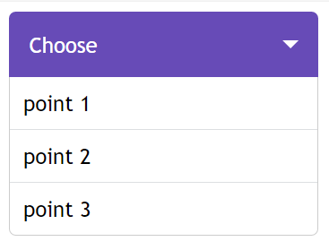

### Mini-framework для элементов **select**

#### Идея:
Фреймворк позволяет кастомизировать выпадающие списки **select** </br>
Он находит все select на странице и заменяет на кастомный
</br>

## Использование:
### Необходимые файлы для работы:
Файл с исходиками (**customSelect.js**) можно найти по пути: ***src/js*** </br>
Файл со стилями (**customSelect.css**) можно найти по пути ***src/css*** </br>
</br>
##### Заменяет все элементы select:
```js
new CustomSelect().render();
```
##### Для получения выбранного значени из списка:
```js
document.getElementById("element-id").value;
```
##### Образец написания select:
```html
<select id="testId" class="custom-select" default="Choose">
    <option>point 1</option>
    <option>point 2</option>
    <option>point 3</option>
</select>
```
**id** - необходим, если собираетесь доставать текущие значения
</br>
**class** - служит идентификатором для framework на замену этого select-а
</br>
**default** - значение по умолчанию
</br>
#### Для сборки проекта (localhost:3000):
1. npm run webpack
2. npm run start


